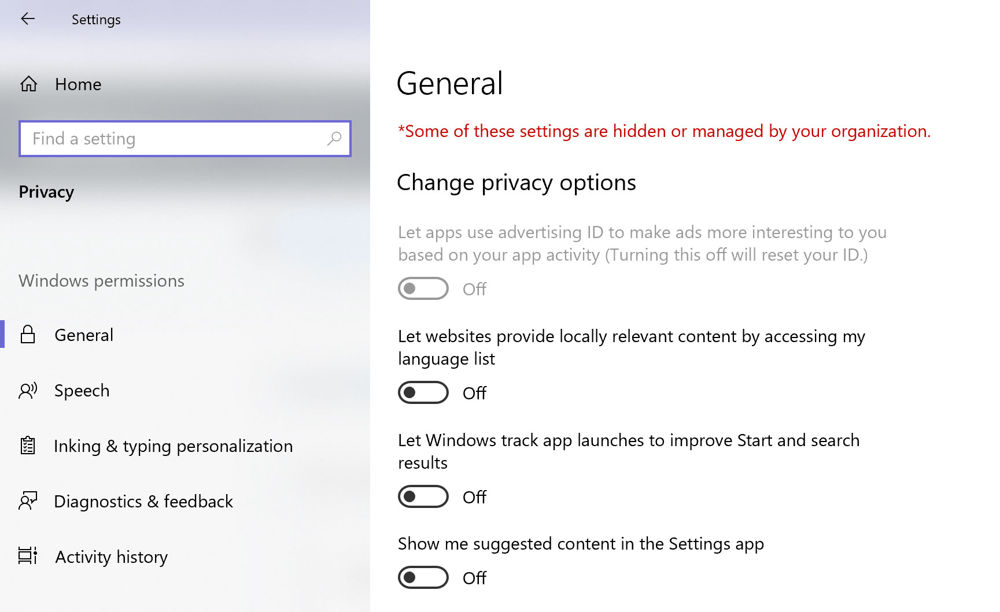
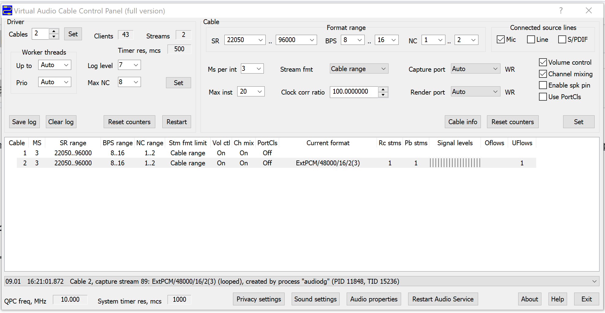
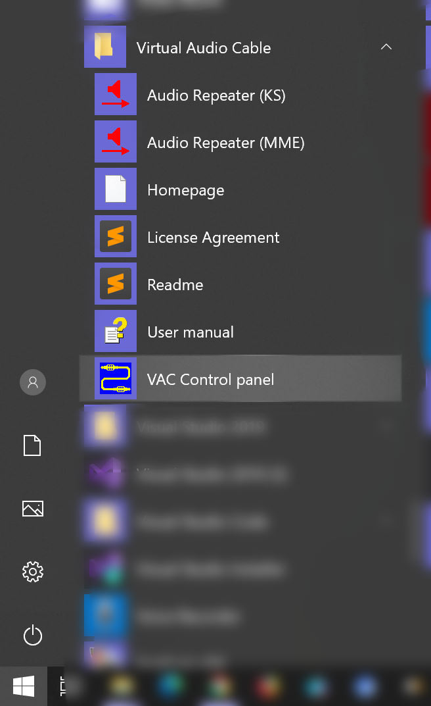
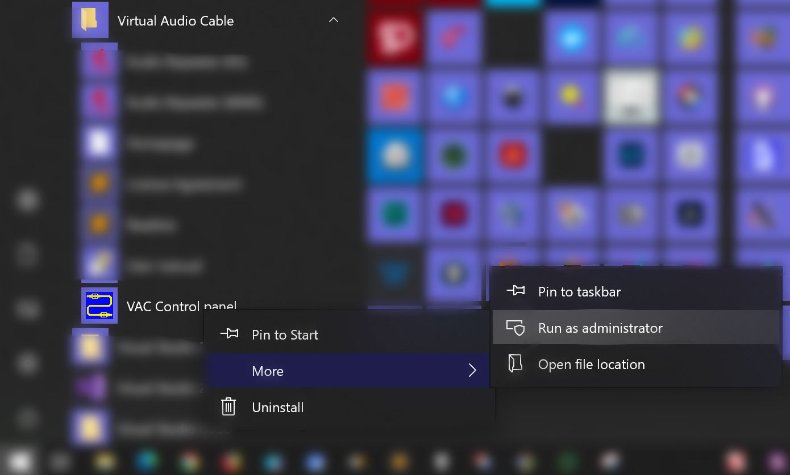
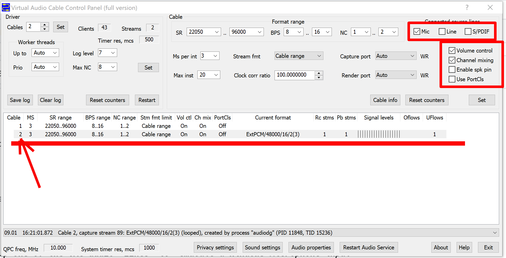
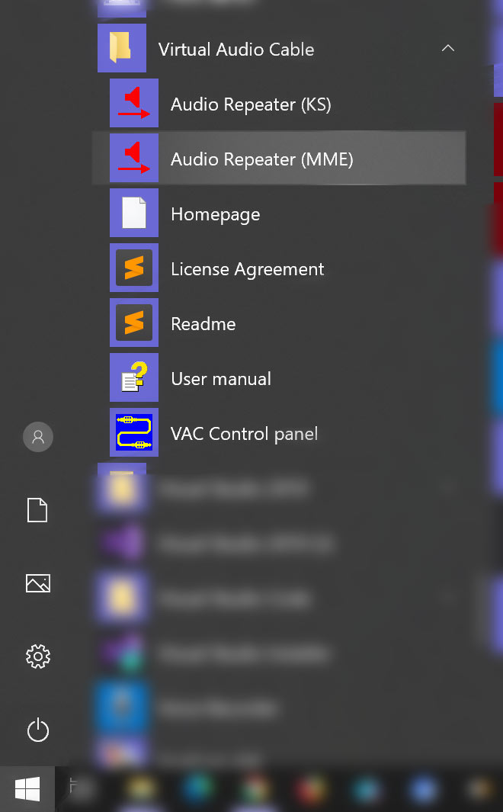
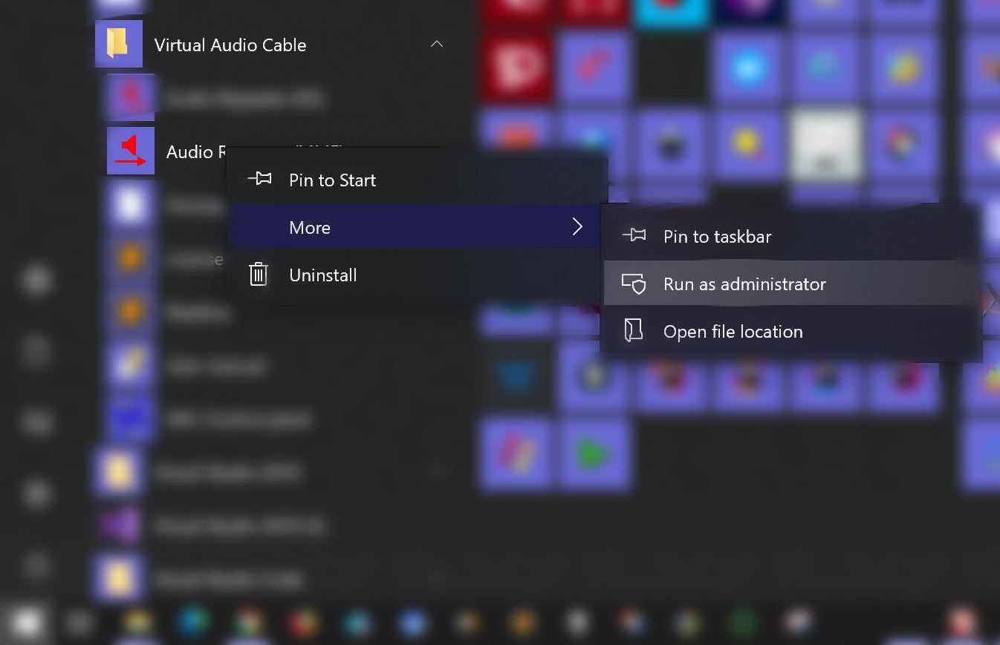
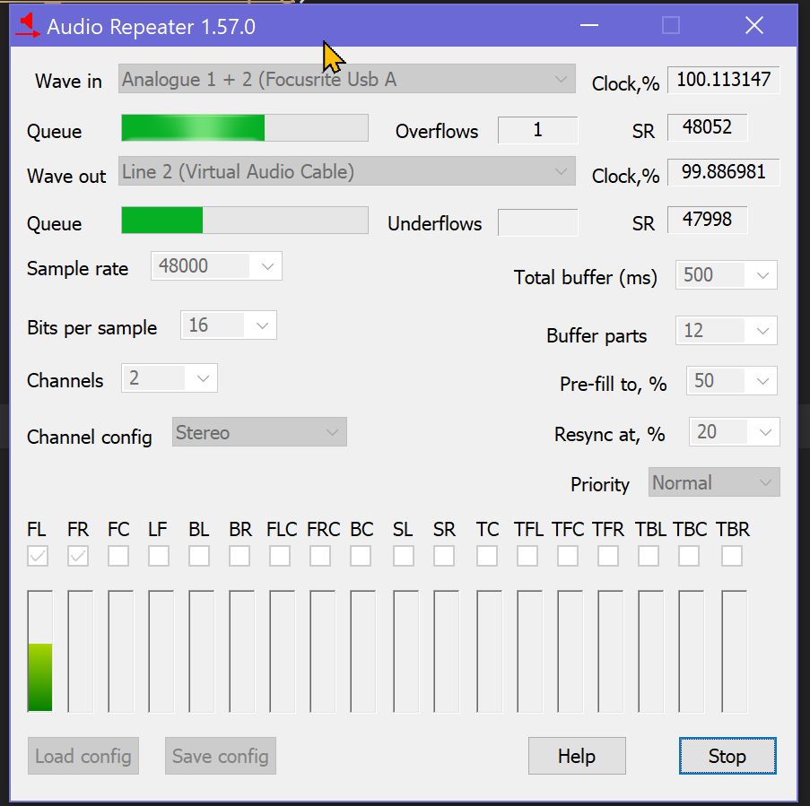
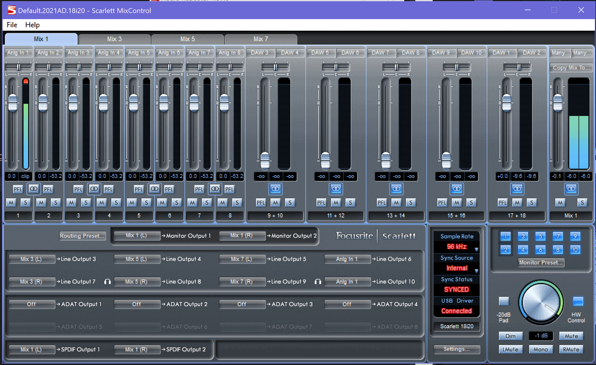
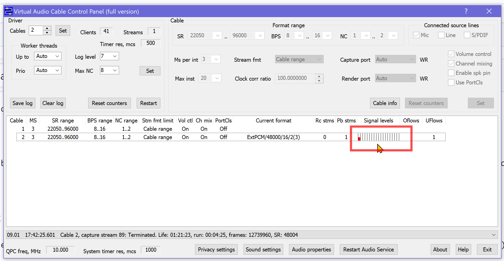

# Connecting professional recording microphones into Nuance Dragon Naturally Speaking

Trouble is Dragon only tolerates *(censored)* machine microphones and the gear they sell themselves. 
I'm **not interested in that stuff**, because I already have gear and microphones which I'm perfectly happy with and Dragon better has got to adjust to that or it can shut the door behind itself on the way out. 

> Yeah, been here before several years ago with Dragon 10 -- or was it 11? -- when I tried that one on for size; 
now re-doing the experiment with Dragon 15 to see if it *might* work for me & my rig. Anyway, here goes...)

## Equipment available

- Focusrite 18i20 (the first generation; works *great*)
- Behringer B-5 microphone
  + there's also an AKG around, but that one is currently back into its box. Anyway, the B-5 is fine for recordings and I'm happy with the mic stands/layout as they are right now in my home room. Sticking with the B-5 here.)
- misc. audio gear, speakers, various headphones (Sennheiser, Beyer Dynamic, Grado)  
- i7 laptop (a.k.a. "the dev box")

## Intent

Use the existing rig, which is controlled through the Focusrite (and its "Control Panel"), as the audio source for Dragon Naturally Speaking.

## Problem

While Dragon *does* show the Focusrite Mix 1 L+R input as one of the choices for input, it barfs a hairball and yaks an alert box about not being able to connect, yada yada yada. *This* I vividly recall from back when I was trying this with Dragon 10 and a different machine.

*The problem here is that Dragon only really accepts **Microphone** Type audio inputs.*

## Solution

- Install *another* piece of software (this is getting hairy...): *Virtual Audio Cable*.

  **WARNING**: Google will drop a whole bunch of those in your lap, but it's all crap *unless* you grab *this one*: [VAC](https://vac.muzychenko.net/en/)
  
  *That one* is the only one that I could find that could reliably create a "external audio line-in input to *microphone-type-emulating* connection point" and you *absolutely need* that 'Mic type' emulation to trick Dragon into connecting and actually trying to listen to you.
  
- Of course, if it was Click & Go Easy, you wouldn't be looking at me banging in a long note about HOW TO DO THIS, because I'll need it *myself* every time I'll set this up after some intermission/hiatus, for *every step is bloody important*.
 

### Side Notes

- I turned off Windows Telemetry crap quite a while back after having had quite a few sneaky load/performance/network problems: it was subtle, but sometimes it looked like some part of the telemetry shite was quarelling with my software firewall ([Virtual Firewall Control](https://www.binisoft.org/wfc) plus [Privoxy](https://www.privoxy.org/) setup which is there to keep a lot of bad crap **out** while I work and roam the Interwebby looking for answers. Anyway, this here is one of the net effects of a long bout of strife with *The Real Windows* to make it bloody well *behave*:

  

  You recognize that "this setting is managed by your administrator" stuff in the control panels everywhere, while *you*! *are*! *the*! *administrator*!?! 
  
  > And, **NO**, despite filling more than 3 pages of Google Search results with it, `gpedit` Group Policy editing this shite to turn The Telemetry Mothers and their mangy dog all the way back to 100 **is not in my horoscope**, so F U 2.

- The "dev box" runs a pretty much up-to-date Windows, at least not older than about a month or so, so it's not an antique either.

- Apparently this goal of wiring pro microphones and audio hardware into Dragon is an idea nobody's got, or my *Google Fu* is totally down the drain, for several searches looking for hints and tips how others did/do it delivered exactly *ZERO RESULTS*.

  > Now I guess these notes are rather *valuable* for folks who think like me. Or am I unique in coming up with this mix of "hey, I've a small studio rig and I'm not exactly 18 anymore, so how about *talking* (instead of keyboard banging) to the bloody machine for a change, eh?"

- I still had some old software from back in the day of Dragon 10 lying around to make this mike-via-pro-hardware happen (yay HD backups!), but that don't fly no more, *very* probably thanks to these and other related Win10 'updates' by Microsoft: the old home-brewed tool spit out an Access Denied error and went belly up, while VAC at least seems to boot okay.

> Date of writing: 2021-jan-9. Windows 10/64.

### How to set up

*Pics* or we don't buy it.

Okay, here goes.

#### Step 1: Install VAC (Virtual Audio Cable) 

#### Step 2: Setup VAC to simulate at least 1(one) connection point. 

I set it up for 2 *virtual nodes*, as I wanted to test it with my audio recording software too, which is perfectly fine with sucking on a Line-In teat instead of a, ahem, *Microphone* Input.

The setup screen:

The important bits to mind here:

- **Run it as Administrator**!

- From the Start Menu:
  
  
  
- Right-click and choose "Run as Administrator":
  
  
  
- Then you'll see this:
  
  
  
#### Step 3: Setup one of the VAC audio "lines" to *emulate a Windows Microphone input*

Be **very careful ensuring the checkboxes in the red attention zones are configured as shown**.

This sets up my VAC audio line 2 up as a Microphone Input, which Dragon will recognize and *accept*.

#### Step 4: Feed your rig's miked input to that VAC audio line.

For this you need to run another VAC tool that came with that install: the way VAC works is through a service, which adds virtual audio inputs, while another tool (call a "**_repeater_**") is required to, ah, "wire up" your real audio feeds with those new virtual nodes, so they can spit out some audio to who needs it (Dragon, in our case).

From the Start menu:

Oh, and be reminded *again*: **run as Administrator**:

We pick the MME-based repeater because I couldn't get the other one to work for my rig. See the screenshot how this one is set up: I am wiring the Focusrite Mix 1 ('Analog 1+2') output to the VAC audio line 2, which is the one configured to emulate a *Microphone Input*:

As I'm breathing down my mike while writing this, you'll see some green bars in there showing us I got signal. Yay!

For reference, here's Mix1 from the focusrite (note the green bars there too as I keep breathing close to the mic...)

#### Step 5: check results so far

This is what you should see:

The little red bar in there is VAC showing us there's audio coming into the 'Mic' line 2: that's me breathing close to the actual microphone!

#### Step 6: Start Dragon Naturally Speaking and connect it to VAC line 2 (our "Microphone")

XXX

# Findings after the fact

Seems you can do all this **once** per Windows session. Exit Dragon and restart that application later and you're toast: the audio line will error ad nauseam. No way out but to reboot your system. Cripes!

---

---

